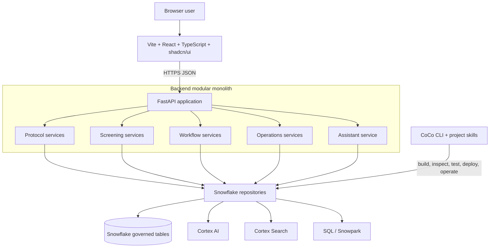
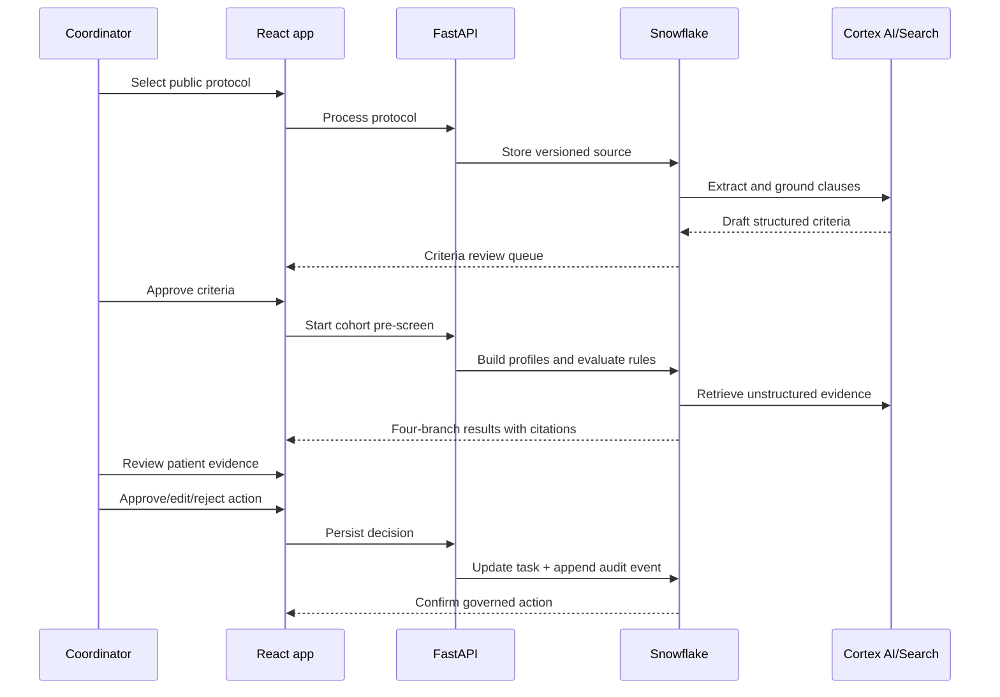

# TrialOps Evidence Desk — Final Build Plan

**Hackathon:** Snowflake CoCo CLI Hackathon 2026  
**Submission track:** PS-04 — Domain-Specific AI Copilot  
**Secondary capability:** PS-01 — Intelligent Workflow Automation  
**Status:** Authoritative build contract; implementation proceeds against this document  
**Prototype rule:** Public protocol data and fully synthetic patient/site data only

## 1. Executive decision

We are building **TrialOps Evidence Desk**, a clinical-trial operations copilot for coordinators, hospital trial offices, and pharmaceutical sponsors.

The product converts a public clinical-trial protocol into reviewed, machine-readable rules; constructs governed synthetic patient profiles; performs evidence-backed pre-screening; creates human-reviewed coordinator work; forecasts recruitment; detects compliance risks; and lets users explore operational scenarios.

This is not a chatbot and it is not an autonomous clinical decision-maker. It is a decision-support and workflow system. It never diagnoses, recommends treatment, confirms clinical eligibility, enrolls a patient, orders a test, or contacts a patient.

The complete hackathon build includes:

1. Seven working agent modules from the architecture document.
2. Three role-specific product views.
3. A digital-twin-style scenario lab.
4. A Vite/React/shadcn frontend.
5. A FastAPI modular-monolith backend.
6. Snowflake tables, Cortex AI, Cortex Search, Snowpark-compatible transformations, RBAC, and audit history.
7. Three reusable CoCo project skills and reproducible CoCo evidence.
8. Automated tests, a public deployed link, a demo video, a deck, and submission documentation.

## 2. What “complete” means

### Included and working

- Public protocol ingestion and versioning.
- AI-assisted eligibility-criteria extraction.
- Human review state for extracted criteria.
- Structured and unstructured synthetic patient evidence.
- Criterion-by-criterion deterministic pre-screening.
- Protocol and patient citations for every result.
- All four safe result branches:
  - `POTENTIAL_MATCH`
  - `EXCLUDED`
  - `MISSING_INFORMATION`
  - `MANUAL_REVIEW`
- Missing-information work generation.
- Approve, edit, reject, and dismiss coordinator actions.
- Idempotent tasks and append-only audit events.
- Recruitment forecasts and site-risk recommendations.
- Visit, consent, report, and protocol-deviation alerts.
- Coordinator, hospital-operations, and sponsor views.
- Natural-language assistant over whitelisted domain workflows.
- Scenario simulation for capacity, site, dropout, and turnaround changes.
- Snowflake-native AI/search evidence and CoCo skill execution.

### Represented by interfaces, not connected to real systems

- EHR/FHIR ingestion contracts.
- EDC/CTMS integrations.
- Real hospital identity providers.
- Real patient outreach and enrollment systems.

These cannot be connected without third-party accounts, agreements, and production data. The prototype demonstrates their boundaries using synthetic fixtures; it does not pretend they are live.

### Explicitly prohibited

- PHI or MIMIC data in the repository or public deployment.
- Automated enrollment, diagnosis, treatment, test ordering, or patient contact.
- Sending Snowflake credentials to the browser.
- Letting an LLM silently override protocol logic or deterministic results.
- Hard-coded final screening outputs.

## 3. Product users and jobs

| User | Primary job | Product view |
|---|---|---|
| Trial coordinator / CRA | Verify evidence, resolve missing information, and decide the next safe workflow step | Coordinator workspace |
| Hospital trial-operations lead | Monitor recruitment, coordinator capacity, visits, and compliance risks | Hospital operations |
| Pharmaceutical clinical-operations lead | Compare sites, forecast completion, and understand portfolio risk | Sponsor portfolio |

The coordinator is the primary demo persona. The other two views prove that the same governed state supports the full architecture.

## 4. Runtime architecture

We will use a **modular monolith**, not microservices. Modules have strict boundaries and can be split later, but the hackathon has one backend deployment, one frontend codebase, and one Snowflake data plane.



### Why not microservices

- Five days does not justify seven deployments, service networking, distributed tracing, queues, and separate credentials.
- The seven agents are application modules, not independently scaled products.
- Snowflake already provides shared compute, persistence, search, AI, access control, and auditability.
- A modular monolith keeps agent contracts testable while protecting delivery speed and demo reliability.

### Deployment topology

The Vite frontend and FastAPI backend remain separate source folders but ship as one Docker deployment:

1. A Node build stage compiles the Vite frontend.
2. The compiled frontend is copied into the Python image.
3. FastAPI serves `/api/*`; the static React application handles all other routes.
4. One public URL is deployed on a Docker-compatible host such as Render or Railway.
5. The backend connects privately to Snowflake using a least-privilege application identity.

This gives us one reliable submission link, same-origin API calls, no CORS complexity, and no Snowflake credential in the browser.

## 5. Repository architecture

```text
snowflake-hackathon/
├── frontend/
│   ├── src/
│   │   ├── app/                 routes, providers, global shell
│   │   ├── components/          shared shadcn-based components
│   │   ├── features/
│   │   │   ├── protocols/
│   │   │   ├── screening/
│   │   │   ├── worklist/
│   │   │   ├── operations/
│   │   │   ├── sponsor/
│   │   │   ├── scenarios/
│   │   │   └── assistant/
│   │   ├── lib/                 API client and formatting
│   │   └── types/               generated/shared API contracts
│   ├── package.json
│   └── vite.config.ts
├── backend/
│   ├── app/
│   │   ├── api/                 FastAPI routers and request/response models
│   │   ├── domain/              pure entities, enums, and policies
│   │   ├── agents/              seven domain agent modules
│   │   ├── services/            end-to-end use-case orchestration
│   │   ├── repositories/        storage interfaces
│   │   ├── adapters/snowflake/  connector, SQL, Cortex AI/Search adapters
│   │   ├── security/            auth context, redaction, validation
│   │   └── main.py
│   ├── tests/
│   └── pyproject.toml
├── snowflake/
│   ├── migrations/              roles, database, schema, tables, views
│   ├── seed/                    public protocol + synthetic demo data
│   ├── procedures/              idempotent screening/workflow procedures
│   ├── search/                  Cortex Search service definition
│   └── verification/            smoke queries and evidence capture
├── .cortex/skills/              three reusable CoCo skills
├── docs/
├── Dockerfile
├── AGENTS.md
└── README.md
```

The existing domain skeleton under `src/ctops` will be relocated into `backend/app/domain` and `backend/app/services` before feature work continues.

## 6. Frontend specification

### Technology

- Vite
- React
- TypeScript
- shadcn/ui
- Tailwind CSS
- React Router
- TanStack Query
- TanStack Table
- Recharts
- React Hook Form + Zod
- Vitest and React Testing Library
- Playwright for the deployed golden path

### Visual direction

The interface is an **annotated protocol workspace**, not a generic admin template.

- Protocol ink: `#10233B`
- Evidence blue: `#1D5A85`
- Verified teal: `#23877E`
- Review amber: `#D7902F`
- Deviation red: `#B84B52`
- Lab paper: `#F4F7F9`

The signature component is the **evidence rail**: protocol clause, patient evidence, rule result, and human-review state are visually connected. This makes explainability part of the page structure.

### Routes

| Route | Purpose |
|---|---|
| `/` | Role-aware command center and current trial status |
| `/protocols` | Protocol source, extraction run, criteria review, and citations |
| `/screening` | Cohort run, status distribution, ranked potential matches |
| `/patients/:patientId` | Criterion matrix and exact evidence rail |
| `/worklist` | Missing-information and review tasks with approve/edit/reject |
| `/operations` | Site recruitment, staffing, visits, and compliance |
| `/sponsor` | Enrollment forecast, site comparison, and risk summary |
| `/scenarios` | Digital-twin-style operational scenario comparison |

The assistant is a contextual drawer available from every route, not the homepage.

### Primary coordinator flow

1. Open the worklist and see what needs attention.
2. Select a patient with `POTENTIAL_MATCH`, `MISSING_INFORMATION`, or `MANUAL_REVIEW`.
3. Review the criterion matrix.
4. Inspect the exact protocol clause and patient source record.
5. Approve, edit, reject, or dismiss the proposed action.
6. See the new task state and audit event immediately.

## 7. Backend specification

### Technology

- Python 3.11+
- FastAPI
- Pydantic v2
- Snowflake Connector for Python / Snowpark Python
- Pure domain services for deterministic decisions
- Pytest
- Ruff
- Structured JSON logging

### API boundary

| Method and path | Purpose |
|---|---|
| `GET /api/health` | Application and Snowflake readiness |
| `GET /api/protocols` | List available protocol versions |
| `POST /api/protocols/ingest` | Register and process a public protocol |
| `GET /api/protocols/{id}/criteria` | Retrieve extracted/reviewed criteria |
| `POST /api/protocols/{id}/criteria/{criterionId}/review` | Approve or reject an extracted criterion |
| `POST /api/screening-runs` | Compute a new idempotent cohort run |
| `GET /api/screening-runs/{id}` | Run totals and validation report |
| `GET /api/screening-runs/{id}/patients` | Patient-level results |
| `GET /api/patients/{id}/evidence` | Unified profile and citations |
| `GET /api/tasks` | Coordinator worklist |
| `POST /api/tasks/{id}/decision` | Approve, edit, reject, or dismiss |
| `GET /api/operations/forecast` | Recruitment forecast by site |
| `GET /api/operations/compliance` | Current compliance alerts |
| `POST /api/scenarios/run` | Compare operational assumptions |
| `POST /api/assistant/query` | Execute a whitelisted domain query |
| `GET /api/audit-events` | Append-only event history |

### Backend rules

- API routers contain no business logic.
- Domain modules do not import FastAPI or Snowflake.
- Repository interfaces are implemented by Snowflake adapters.
- All writes use idempotency keys.
- All human decisions create append-only audit events.
- Model-produced JSON is schema-validated before persistence.
- Mutating assistant requests require an explicit confirmation token.
- Errors return a correlation ID without revealing SQL, credentials, or private configuration.

## 8. The seven agent modules

“Agent” means a bounded domain worker with an explicit input, tool policy, output schema, validation, and audit record. LLM use is limited to tasks where language understanding is required.

### Agent 1 — Protocol Intelligence

**Input:** public ClinicalTrials.gov study JSON and protocol/eligibility text.  
**Uses:** Cortex AI structured extraction; optional document understanding for a staged PDF.  
**Output:** versioned protocol clauses, inclusion/exclusion criteria, visit requirements, tests, biomarkers, and manual-review flags.  
**Validation:** enum, unit, operator, temporal-window, AND/OR, negation, source-clause, and source-location validation.  
**Human gate:** extracted criteria remain `DRAFT` until reviewed.

### Agent 2 — Patient Intelligence

**Input:** demographics, diagnoses, medications, labs, visits, and synthetic notes/reports.  
**Uses:** SQL/Snowpark normalization plus Cortex Search for unstructured evidence.  
**Output:** a versioned patient-evidence profile with source record, observation time, unit, normalized concept, and contradiction flags.  
**Rule:** missing evidence remains missing; the agent never infers absent diagnoses, pregnancy status, medication, consent, or biomarkers.

### Agent 3 — Eligibility Reasoning

**Input:** reviewed criteria and versioned patient profiles.  
**Uses:** deterministic Python/SQL for numeric, categorical, Boolean, and temporal criteria. Cortex AI may explain a stored result but cannot determine or change it.  
**Output:** `MET`, `NOT_MET`, `UNKNOWN`, or `CONTRADICTORY` per criterion and one safe overall pre-screen status.  
**Citations:** exact protocol clause plus exact patient record for every result.

### Agent 4 — Missing Information

**Input:** unknown criteria and evidence freshness requirements.  
**Uses:** deterministic mapping from missing evidence to coordinator-safe next steps.  
**Output:** tasks such as `VERIFY_EXISTING_LAB`, `LOCATE_REPORT`, or `CLINICAL_REVIEW_REQUIRED`.  
**Rule:** it describes missing information; it does not order a test or contact a patient.

### Agent 5 — Recruitment Forecast

**Input:** target enrollment, current enrollment, weekly screening/enrollment funnel, dropout rate, site capacity, and historical site velocity.  
**Uses:** transparent rolling-velocity and retention-adjusted projections.  
**Output:** projected completion date, risk band, contributing measures, and operational recommendation.  
**Scenario support:** recompute with new-site capacity, coordinator capacity, dropout, or turnaround assumptions.

### Agent 6 — Protocol Compliance

**Input:** scheduled visits, completed visits, consent records, required reports, and protocol windows.  
**Uses:** deterministic due-date and completeness rules.  
**Output:** missed-visit, approaching-window, missing-consent, missing-report, and deviation alerts.  
**Rule:** alerts are deduplicated and remain reviewable; corrections append new events.

### Agent 7 — Coordinator Assistant

**Input:** a natural-language operational question and current page context.  
**Uses:** Cortex AI intent extraction, Cortex Search evidence, and whitelisted backend tools.  
**Supported intents:** shortlist explanation, missing-information query, recruitment slowdown, site comparison, upcoming visits, and compliance-risk summary.  
**Output:** answer, contributing data, citations, timestamp, and an optional proposed action.  
**Rule:** no arbitrary generated SQL and no mutation without explicit user confirmation.

## 9. Snowflake architecture

### Account objects

- Database: `CTOPS_HACKATHON`
- Schemas:
  - `RAW` — source protocol and synthetic source records
  - `CORE` — normalized domain state
  - `AI` — search services, extraction outputs, agent runs
  - `APP` — API-facing secure views, tasks, and audit events
- Warehouse: initially `COMPUTE_WH`, with a small dedicated warehouse if trial credits allow.
- Application role: `CTOPS_APP_ROLE`
- Setup role: `ACCOUNTADMIN` only for one-time grants and object ownership transfer.

### Snowflake services

| Capability | Snowflake implementation |
|---|---|
| Governed persistence | Structured tables, views, streams/tasks where useful |
| Protocol extraction | `AI_COMPLETE` structured output and document input when supported |
| Unstructured grounding | Cortex Search over protocol clauses and synthetic clinical documents |
| Structured transformations | SQL and Snowpark-compatible Python |
| Deterministic screening | SQL/Python rules persisted with versions |
| Natural-language explanations | Cortex AI over stored results and retrieved evidence |
| Governance | RBAC, least privilege, query history, application audit events |

## 10. Demo data plan

### Public source

The primary demonstration protocol will be based on the public ClinicalTrials.gov record **NCT00749190**, “BI 10773 add-on to Metformin in Patients With Type 2 Diabetes.” It has concrete criteria covering diagnosis, medication, HbA1c, age, BMI, cardiovascular history, hepatic function, and renal function.

The app will state clearly that this is a synthetic operational demonstration based on a public study record, not a live recruitment system for that completed study.

If document-input support is stable in the account, the corresponding public protocol PDF will also be staged and processed. The ClinicalTrials.gov JSON/eligibility text remains the deterministic fallback.

### Synthetic dataset size

| Data | Planned volume | Purpose |
|---|---:|---|
| Protocols | 1 primary, 1 optional secondary | Versioning and protocol selection |
| Protocol clauses | 12–20 | Citations and retrieval |
| Reviewed eligibility criteria | 8–12 | All evaluator types and edge cases |
| Trial sites | 3 | Site comparison and forecast branches |
| Synthetic patients | 36 | Credible cohort without PHI |
| Patient facts | Approximately 300 | Demographics, diagnoses, medications, labs |
| Synthetic clinical documents | 60–80 | Notes, pathology, radiology, discharge evidence |
| Recruitment observations | 12 weeks × 3 sites | Forecasting and trend comparison |
| Enrolled synthetic participants | 18–24 | Visit/compliance workflow |
| Scheduled visits | 50–70 | Due, complete, missed, and approaching windows |
| Consent/report records | 30–50 | Compliance branches |

### Deliberate screening distribution

The synthetic facts are designed to exercise behavior; results are still computed:

- Approximately 10 `POTENTIAL_MATCH`
- Approximately 10 `EXCLUDED`
- Approximately 8 `MISSING_INFORMATION`
- Approximately 8 `MANUAL_REVIEW`

Fixtures will cover boundary values, unit normalization, stale labs, missing biomarkers, contradictory notes, recent cardiovascular events, BMI limits, age limits, and medication-dose evidence.

### Core tables

| Table | Important columns |
|---|---|
| `RAW.PROTOCOL_DOCUMENTS` | protocol ID, source URL, source type, raw content, content hash, received time |
| `CORE.TRIALS` | protocol ID, title, sponsor, phase, condition, status, target enrollment |
| `CORE.PROTOCOL_CLAUSES` | clause ID, protocol ID, section, location, exact text, document hash |
| `CORE.ELIGIBILITY_CRITERIA` | criterion ID/type, concept, operator, values, unit, temporal window, machine-evaluable, review status |
| `CORE.PATIENTS` | synthetic patient ID, site, age/sex fields, synthetic marker |
| `CORE.PATIENT_FACTS` | patient, fact key, typed value, unit, observed time, source ID, contradiction flag |
| `CORE.CLINICAL_DOCUMENTS` | patient, document type, text, date, source ID, synthetic marker |
| `CORE.SITES` | site, region, target, capacity, activation date |
| `CORE.RECRUITMENT_WEEKLY` | site, week, screened, potential matches, consented, enrolled, dropped out |
| `CORE.VISITS` | participant, visit, expected date/window, completed time, status |
| `CORE.DOCUMENT_STATUS` | participant, consent/report type, required, present, verified time |
| `AI.AGENT_RUNS` | agent, run ID, input/output version, model/tool, status, warnings, timestamps |
| `AI.PATIENT_PROFILES` | profile version and normalized evidence summary |
| `AI.SCREENING_RUNS` | run, protocol/rule version, cohort, status, counts, timestamps |
| `AI.CRITERION_RESULTS` | run, patient, criterion, result, protocol citation, patient citation, explanation |
| `AI.SCREENING_RESULTS` | run, patient, overall safe status, evidence completeness, timestamp |
| `APP.COORDINATOR_TASKS` | task key, patient, action type, state, owner, reason, source result |
| `APP.FORECAST_RESULTS` | site, as-of time, velocity, projected completion, risk, recommendation |
| `APP.COMPLIANCE_ALERTS` | alert key, participant, type, severity, state, evidence |
| `APP.AUDIT_EVENTS` | event ID, actor, action, prior/new state, reason, correlation ID, timestamp |

### Data safety

- Every patient and clinical document is visibly marked synthetic.
- Names use neutral display IDs rather than realistic personal names.
- No MIMIC files, PHI, emails, phone numbers, addresses, or dates of birth are used.
- Public protocol source attribution and retrieval dates are stored.
- Seed generation is deterministic and reproducible.

## 11. How CoCo is used

CoCo is central to how the project is built, verified, and operated, but the deployed website does not shell out to a developer CLI for every user request.

### Project context

`AGENTS.md` gives CoCo the product mission, clinical safety language, Snowflake architecture, test policy, and credential restrictions. CoCo loads it whenever it operates in this repository.

### Three reusable project skills

| CoCo skill | Covers | Expected Snowflake activity |
|---|---|---|
| `protocol-intelligence` | Protocol ingestion, AI extraction, schema validation, criterion review | Stage/file inspection, AI functions, clause and criteria writes |
| `patient-screening` | Patient profiling, evidence retrieval, deterministic screening, result validation | Table/object search, Cortex Search, screening procedures and result reads |
| `coordinator-action-orchestrator` | Missing-information work, actions, forecasting, compliance, scenarios, audit | Task/alert/forecast procedures, idempotent writes, audit verification |

Three skills match the PS-04 guidance to demonstrate two or three modular custom skills orchestrated together. The seven runtime agents are grouped into these reusable operational workflows rather than creating one superficial skill per class.

### CoCo development workflow

1. Launch with `cortex -c hackathon -w "$PWD"`.
2. Run `/skill list` and capture discovery of the three project skills.
3. Use `protocol-intelligence` to inspect the account, propose/execute migrations, ingest the protocol, and validate criteria.
4. Use `patient-screening` to inspect the seeded cohort, run the computed branches, and report citations and validation failures.
5. Use `coordinator-action-orchestrator` to generate work, forecasts, compliance alerts, scenario outputs, and audit evidence.
6. Use CoCo to inspect Snowflake objects and troubleshoot deployment/test failures.
7. Save sanitized command/output evidence for the README, deck, and demo recording.

### CoCo demo evidence

The demo must visibly prove:

- CoCo is authenticated to the Snowflake account.
- CoCo discovers the three repository skills.
- A project skill invokes real Snowflake SQL and Cortex AI/Search.
- A screening run produces all four computed branches.
- An approved action creates a changed task state and a new append-only audit event.
- CoCo can inspect and explain the resulting Snowflake objects.

### Runtime distinction

- **CoCo CLI:** developer/operations agent for building, deploying, inspecting, repeating, and demonstrating the workflows.
- **FastAPI runtime:** stable application API used by the public React frontend.
- **Snowflake:** common governed state and AI/data execution plane used by both.

This is more reliable and secure than running a developer CLI inside a public web request.

## 12. End-to-end workflow



Forecasting, compliance, and scenario calculations read the same governed site, visit, and recruitment state and are available in their role-specific views.

## 13. Security and authentication

### Local development

- Connection name: `hackathon`
- Non-secret connection settings: `~/.snowflake/connections.toml`
- Temporary Local OAuth credential: macOS secure credential store
- File permissions: user-only
- Nothing copied into the repository or Vite environment

### Deployed application

- Create a least-privilege `CTOPS_APP_ROLE`.
- Use a dedicated application identity with key-pair authentication or a scoped PAT.
- Store the private credential only in the deployment host’s encrypted secret manager.
- The React build receives only the same-origin API base path.
- Never expose Snowflake account credentials through `VITE_*` variables.
- Use synthetic data so the public demo has no PHI risk.

### Production-shaped controls demonstrated

- RBAC and least-privilege grants.
- Human approval for material actions.
- Append-only audit events.
- Idempotency keys.
- Prompt-injection-resistant retrieval boundaries.
- Model-output schema validation.
- Safe uncertainty and clinical wording.
- Correlation IDs and sanitized errors.

## 14. Testing strategy

| Layer | Tests |
|---|---|
| Domain | Every operator, boundary, status branch, task transition, forecast branch, and compliance rule |
| Agent contracts | Valid/invalid model output, missing citations, stale evidence, contradictions, unsupported logic |
| Repository | Snowflake read/write mapping, idempotent reruns, append-only audit behavior |
| API | Request validation, response schemas, errors, mutation confirmation, health checks |
| Frontend | Evidence rail, filters, branch states, actions, empty/error/loading behavior |
| Integration | Protocol → screening → task → human decision → audit event |
| Deployment | Public URL, API health, Snowflake access, browser golden path |

No test will assert a hard-coded patient outcome without running the rules that produce it.

## 15. Five-day delivery plan

### Day 1 — Foundation and data plane

- Approve this build contract.
- Reorganize into `frontend/`, `backend/`, and `snowflake/`.
- Create backend contracts, repository interfaces, migrations, roles, and schemas.
- Generate and load the public protocol plus deterministic synthetic dataset.
- Verify Cortex AI access and create the search service.

**Gate:** Snowflake contains the reproducible source dataset and the backend test suite passes.

### Day 2 — Protocol, patient, eligibility, and missing information

- Complete Agents 1–4.
- Validate model-produced criteria against schemas.
- Compute all four screening branches.
- Persist criterion and overall results with both citation types.
- Create missing-information tasks.
- Expose protocol, screening, patient-evidence, and task APIs.

**Gate:** one API-driven run proves protocol → cohort → cited result → task.

### Day 3 — Forecast, compliance, assistant, and scenarios

- Complete Agents 5–7.
- Add recruitment projections and recommendations.
- Add compliance alerts and task deduplication.
- Add whitelisted assistant intents.
- Add scenario comparison.
- Complete action transitions and audit history.

**Gate:** all seven modules produce persisted, explainable outputs.

### Day 4 — React product and deployment

- Build the application shell and evidence-rail design system.
- Complete all routes and role-specific views.
- Integrate TanStack Query with FastAPI.
- Add loading, empty, error, mobile, keyboard, and reduced-motion behavior.
- Build the Docker image and deploy the public URL.
- Run end-to-end tests against the deployment.

**Gate:** the 90-second golden path succeeds from the public link without developer intervention.

### Day 5 — Hardening and submission

- Run all unit, integration, SQL, and browser checks.
- Capture CoCo skill and Snowflake evidence.
- Record a backup demo before cosmetic changes.
- Finish README, architecture, setup instructions, demo script, and submission checklist.
- Complete the supplied presentation template.
- Record the final demo and verify every submitted link in an incognito browser.

**Gate:** repository, deployed link, video, deck, and submission text are complete and internally consistent.

## 16. Demonstration script

### Public product demonstration

1. Open the deployed command center and select the diabetes protocol.
2. Show reviewed criteria tied to exact public source clauses.
3. Run the synthetic cohort pre-screen.
4. Show the four result branches and open a potential match.
5. Walk the evidence rail: criterion, structured fact/note, result, and explanation.
6. Open a missing-information task and approve an edited safe action.
7. Show the append-only audit event.
8. Switch to hospital operations for a compliance alert and recruitment risk.
9. Switch to sponsor portfolio for projected completion and site comparison.
10. Change coordinator capacity in Scenario Lab and show the recomputed impact.

### CoCo proof

1. Show `/skill list` with all three project skills.
2. Invoke one skill against Snowflake.
3. Show the SQL/AI objects it uses and the structured completion report.
4. Show that the React product reads the resulting governed state.

## 17. Definition of done

The project is not complete until all of the following are true:

- [ ] PS-04 is stated consistently in the README, deck, demo, and submission.
- [ ] `frontend/`, `backend/`, and `snowflake/` are clearly separated.
- [ ] The public protocol source and synthetic dataset are reproducible.
- [ ] All seven agent modules execute real logic.
- [ ] The three CoCo project skills are discovered and used.
- [ ] Cortex AI is used for language/document intelligence.
- [ ] Cortex Search is used for grounded unstructured evidence.
- [ ] Deterministic rules—not an LLM—produce screening status.
- [ ] All four screening branches are computed from fixtures.
- [ ] Every criterion result has protocol and patient citations where evidence exists.
- [ ] Missing/ambiguous evidence fails closed.
- [ ] Coordinator actions require human review and create audit events.
- [ ] Forecasting, compliance, and scenario views use computed data.
- [ ] Coordinator, hospital, and sponsor experiences are functional.
- [ ] Browser users never receive Snowflake credentials.
- [ ] Unit, API, integration, SQL, and browser tests pass.
- [ ] A public deployed link works in an incognito browser.
- [ ] GitHub repository contains no credential, token, private key, or PHI.
- [ ] README, runbook, demo script, deck, and video are complete.

## 18. Build priority if time becomes constrained

No architecture agent is silently removed. If time pressure occurs, depth is protected in this order:

1. Protocol → evidence → deterministic pre-screen → human action → audit.
2. Recruitment forecast and compliance with transparent computed rules.
3. Three polished role views.
4. Assistant intent breadth.
5. Number of protocols and synthetic records.
6. Scenario-control breadth.

The deployed path, citations, safety, and auditability are never traded for extra superficial features.

## 19. Final positioning

**One-line product:** The governed evidence desk that turns a clinical-trial protocol and fragmented patient records into a cited coordinator worklist, recruitment forecast, and auditable human action.

**One-line differentiation:** Not just patient matching—an explainable, Snowflake-native operations loop spanning protocol intelligence, pre-screening, missing information, recruitment, compliance, and coordinator action.

**Submission track:** PS-04, because the core value is a healthcare-specific copilot that understands clinical-trial terminology, constraints, guardrails, evidence, decision branches, and realistic user workflows.
